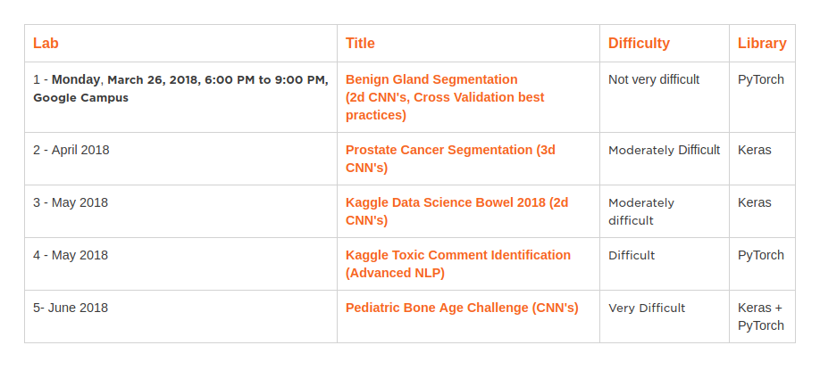

# 12 Applied Deep Learning Labs, 2018

## Tel Aviv Deep Learning Bootcamp : http://deep-ml.com

Contact: shlomo@bayesian.io 

### About
Tel-Aviv Deep Learning Bootcamp is an intensive (and free!) 5-day program intended to teach you all about deep learning. It is nonprofit focused on advancing data science education and fostering entrepreneurship. The Bootcamp is a prominent venue for graduate students, researchers, and data science professionals. It offers a chance to study the essential and innovative aspects of deep learning.	

Participation is via a donation to the A.L.S ASSOCIATION for promoting research of the Amyotrophic Lateral Sclerosis (ALS) disease. 

# Full schedule:
Refer to: 
https://www.evernote.com/shard/s341/sh/3855640e-2b0b-42e5-b5b9-00216d02ac9a/b47968226e49a81ee813901cd41d3924

#### Meetup:

#### Registration:
You can register, however we reserve no places, folowing a first come first serve policy. 

### Requirements

- Ubuntu Linux 16.04, Mac OSX or Windows 10
- Python 3.5 or above 
- CUDA 9.0 drivers.
- cuDNN 7.0.

- [pytorch](https://github.com/pytorch/pytorch) >= 0.2.0
- [torchvision](https://github.com/pytorch/vision) >= 0.1.8
- [Pillow](https://github.com/python-pillow/Pillow)
- [scipy](https://github.com/scipy/scipy)
- [tqdm](https://github.com/tqdm/tqdm)
- Keras

## IDE

This project has been realised with [*PyCharm*](https://www.jetbrains.com/pycharm/) by *JetBrains*

# Relevant info:

http://deep-ml.com/

## Author
Shlomo Kashani/ [@QuantScientist](https://github.com/bayesianio) and many more. 

