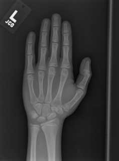

# 12 Applied Medical Deep Learning Labs, 2018

## Author
Shlomo Kashani, Head of Deep Learning at  http://DeepOncology.ai 

## Tel Aviv Deep Learning Bootcamp : http://deep-ml.com



# Full schedule:
Refer to: 
https://www.evernote.com/shard/s341/sh/3855640e-2b0b-42e5-b5b9-00216d02ac9a/b47968226e49a81ee813901cd41d3924

## Forum:
https://bayesian-ai.trydiscourse.com/categories


Contact: Shlomo Kashani at shlomo@deeponcology.ai

# Google Collab + PyTorch Notebooks:
- https://colab.research.google.com/drive/1y0pgDW_0r4tPSk6URgWc3UekejIKBxDd

- https://drive.google.com/file/d/1YJQlgbjY4Mj50l6f3cN008oW-LKlBWfQ/view
- https://drive.google.com/file/d/11BhMeqYjMds92t9PgcVW7SZxF3ZWcgj0/view
- https://drive.google.com/file/d/1qf2hH9XsvHtNwTEzZRyqgsn_2vfG3flw/view

# Labs:
- Lab 01- Melanoma Classification: https://github.com/bayesianio/applied-dl-2018/blob/master/lab-0-SeNet-SeedLings.ipynb and https://bayesian-ai.trydiscourse.com/t/12-applied-deep-learning-labs-1-melanoma-detection/20
- Lab 02- Breast Cancer Classification: https://github.com/bayesianio/applied-dl-2018/blob/master/lab-2-Breast-Cancer-Histopathology-SeNet.ipynb and https://bayesian-ai.trydiscourse.com/t/12-applied-deep-learning-labs-2-breast-cancer-classification/21


### About
We are happy to introduce our full (and Free) Applied Deep course Learning curriculum for 2018. 
Assembling this curriculum required a lot of thought and attention, aiming at using real use cases and corresponding real data sets.

Deep learning, a sub-domain of machine learning, has lately showed amazing results across an assortment of domains. Biology and medicine are data affluent, but the data is involved and frequently ill-understood. Problems of this quality may be especially well-suited to deep learning methods. We present applications of applied deep learning to a variety of biomedical problems

In particular, we foster the use of **Medical Data Sets** (https://grand-challenge.org/All_Challenges/) and predominantly those available (but not only) via Kaggle. 

The course consists of 12 labs from which we like to share the first 5, and most notably, the labs are geared towards those interested in practical/applied data science rather than theoretical data science. We feel there are a numerous theoretical DL courses while the practical ones are rather scarce. 


In terms of DL libraries, we foster the use of **Keras and PyTorch** and we hope to alternate between these two in each subsequent class.

This is a provisional curriculum, which is subject to change. 


#### Registration:
You can register, however we reserve no places, folowing a first come first serve policy. 

### Requirements

- Ubuntu Linux 16.04, Mac OSX or Windows 10
- Python 3.5 or above 
- CUDA 9.0 drivers.
- cuDNN 7.0.

- [pytorch](https://github.com/pytorch/pytorch) >= 0.2.0
- [torchvision](https://github.com/pytorch/vision) >= 0.1.8
- [Pillow](https://github.com/python-pillow/Pillow)
- [scipy](https://github.com/scipy/scipy)
- [tqdm](https://github.com/tqdm/tqdm)
- Keras

## Data Sets in PyTorch 
Keep in mind that this repository expects data to be in same format as Imagenet. I encourage you to use your own datasets. 
In that case you need to organize your data such that your dataset folder has EXACTLY two folders. Name these 'train' and 'val'

**The 'train' folder contains training set and 'val' fodler contains validation set on which accuracy / log loss is measured.**  

The structure within 'train' and 'val' folders will be the same. 
They both contain **one folder per class**. 
All the images of that class are inside the folder named by class name; this is crucial in PyTorch. 

If your dataset has 2 classes like in the Kaggle Statoil set, and you're trying to classify between pictures of 1) ships 2) Icebergs, 
say you name your dataset folder 'data_directory'. Then inside 'data_directory' will be 'train' and 'test'. 
Further, Inside 'train' will be 2 folders - 'ships', 'icebergs'. 

## So, the structure looks like this: 


```
|-  data_dir
       |- train 
             |- ships
                  |- ship_image_1
                  |- ship_image_2
                         .....

             |- ice
                  |- ice_image_1
                  |- ice_image_1
                         .....
       |- val
             |- ships
             |- ice
```

For a full example refer to: https://github.com/QuantScientist/Deep-Learning-Boot-Camp/blob/master/Kaggle-PyTorch/PyTorch-Ensembler/kdataset/seedings.py 


# Relevant info:

http://deep-ml.com/

