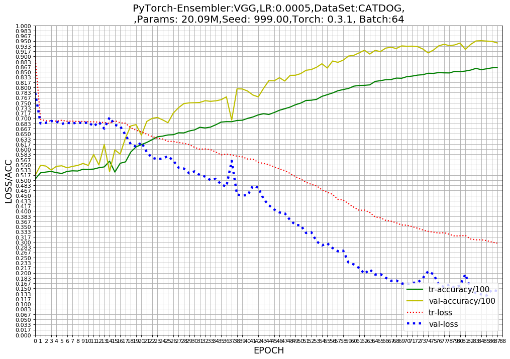

## [lab_9_cat_dog Classifier Challenge]( https://www.kaggle.com/)


Relevant Kaggle contest: 
https://www.kaggle.com/c/dogs-vs-cats-redux-kernels-edition
    

# Prerequisites

- Computer with Linux or OSX
- [PyTorch](http://pytorch.org) version **2 and up**
- For training, an NVIDIA GPU is strongly recommended for speed. CPU is supported but training is very slow.

## Setup and Installation


## Python Requirements


## Progress

- [x] Binary Classification on the cat dog Data Set
- [x] SENet
- [x] Curve generation, ACC/LOSS in PNG format and in TensorBoard    

### Networks Used (See *models* folder for details)

- [x] VGGNet ([paper](https://arxiv.org/abs/1409.1556))


### Single model Log loss 

| network               | dropout | preprocess | GPU       | params  | training time | Loss   |
|:----------------------|:-------:|:----------:|:---------:|:-------:|:-------------:|:------:|
| VGG        |    -    |   meanstd  | GTX1080  |          |         |        |
| Residual-Network50    |    -    |   meanstd  | GTX1080  |          |    |        |
| DenseNet-100x12       |    -    |   meanstd  | GTX1080  |          |    |        |
| ResNeXt-4x64d         |    -    |   meanstd  | GTX1080  |          |    |        |
| SENet(ResNeXt-4x64d)  |    -    |   meanstd  | GTX1080  |          |  -            |   -    |


### Log loss 




### Usage


```
python -m visdom.server
```

**To train the model :**

```
```

**To validate the model :**

```
```

**To test the model w.r.t. a dataset on custom images(s):**

```
```
  
## Contributors   
Credits: Shlomo Kashani and many others. 

[Shlomo Kashani](https://github.com/QuantScientist/Deep-Learning-Boot-Camp/) 
